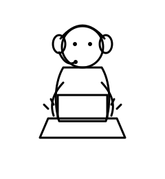
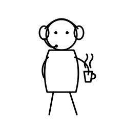
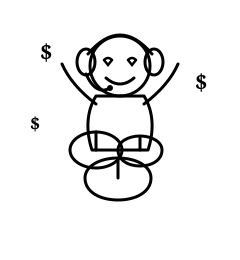

# doodle-status-prompt

미니멀 흑백 손그림 캐릭터(원형 얼굴, 점 눈, 오버이어 헤드셋)가 주어진 상황에 놓인 모습을 그리도록 하는 영어 이미지 생성 프롬프트를 만들어 준다. 블로그 삽화나 Slack/Notion 상태 아이콘 용도. 실제 워크플로우는 [`AGENTS.md`](./AGENTS.md)에 있다.

아래 이미지는 스타일을 보여주기 위해 직접 그린 라인아트 목업이다 (AI 생성물 아님) — 채워 넣은 프롬프트가 실제로 어떤 그림으로 이어지는지 감을 잡기 위한 참고용.

## 예시 1 — 노트북으로 코딩 중



입력: `"코딩에 집중하는 상황"`

```
A minimalist hand-drawn doodle, simple black and white line art, a character wearing a headset sitting behind a laptop, front view, typing quickly with a focused expression, clean white background, no shading, thin uniform black lines, expressive comic-style symbols, cute and simple sketch.
```

## 예시 2 — 커피 마시며 산책 (노트북 없음, 얼굴 고정)



입력: `"커피 마시며 여유롭게 산책하는 상황"`

```
A minimalist black and white hand-drawn doodle sketch, exactly mimicking the style of the provided reference images. The main subject is the specific simple character consisting of a circle head, two small dots for eyes, and over-ear headphones with a small microphone boom. This exact character is currently walking leisurely while holding a take-out coffee cup, with a small steam icon rising from the cup. Keep the facial features simple and consistent with the reference character's standard look. No shading, clean white background, sketchy thin black lines.
```

## 예시 3 — 월급 받고 신남 (감정 기호 활용)



입력: `"월급 받아서 신난 상황"`

```
A minimalist black and white hand-drawn doodle sketch, exactly mimicking the style of the provided reference images. The main subject is the specific simple character consisting of a circle head, two small dots for eyes, and over-ear headphones with a small microphone boom. This exact character is currently sitting happily on a pile of money bags, arms raised, eyes replaced by simple cartoon hearts, with dollar sign '$' icons floating around and a big smile. Keep the facial features simple and consistent with the reference character's standard look. No shading, clean white background, sketchy thin black lines.
```

## 설치

레포 루트의 [README.md](../README.md#설치)를 참고해 도구별로 심볼릭 링크/복사한다. Claude Code라면:

```bash
ln -s "$PWD/doodle-status-prompt" ~/.claude/skills/doodle-status-prompt
```
